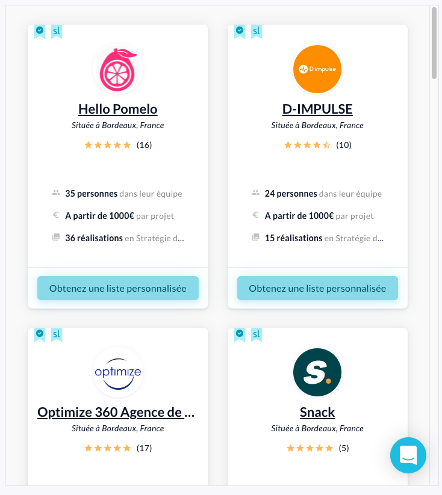

# La liste intégrée d'agences

## 1. Mise en place:

Afin de pouvoir intégrer notre liste d'agences sur votre site (ex: https://iframetester.com/?url=https://www.sortlist.fr/web-marketing/paris-fr/embed) il vous faudra utiliser le code iframe suivant : 

```html
<iframe id="sortlist-iframe" src="https://www.sortlist.fr/web-marketing/bordeaux-aquitaine-fr/embed?ae=35" style="display: block; min-height: 40rem; min-width: 100%;" title="Les Meilleures Agences de Communication à Bordeaux"><br /> </iframe>
```

## 2. Paramètres disponibles:
Comme vous pouvez le remarquer, il y a différents paramètres à utiliser :

| Paramètre   | Description            | Remarques  | 
| :---------- | :---------------- | :--------    | 
| `<id>` | Recommandé d'en utiliser un par défaut, vous pouvez garder "sortlist-iframe" |
| `<src>` | L'url de la liste intégrée d'agences qui correspond à l'url de la longue traine, suivi de `</embed>`. Essayez le sur une liste existante de votre site et rajoutez `</embed>` à la fin de celui-ci. Si vous avez un résultat, vous pourrez valider que cela fonctionne correctement. | /!\ AFFILIATION ID : n'oubliez pas d'intégrer l'id pour l'affiliation! A la fin de l'url, vous pouvez rajouter `<?ae=ae_id>` qui correspond à votre code affilié. | 
| `<style>` | Ceci permet que la liste soit adaptée aux tailles (Lxl) de votre site. Vous pouvez adapter le style si vous le souhaitez. |
| `<title>` | C'est toujours bien d'ajouter un titre en adéquation avec la liste intégrée (comme par exemple, le nom de l'expertise et de la localisation) |

## 3. Exemple de la liste ci-dessous:

{: loading=lazy }

## Des questions?

Contactez **Olivier Danniau**, notre responsable partenariats France au [+33 (0) 7 56 93 64 56](tel:+33756936456)


